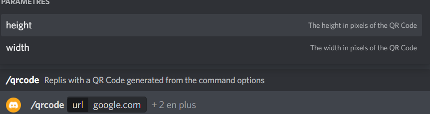

# DiscrodBot_QRCodeGenerator

DiscrodBot_QRCodeGenerator is a Discord bot used to generate QR code from URL passed along a command.

## Installation
1. Download the repository and unzip it.
2. Create a local_config.json file and add your differents tokens as follows:
    ```
    {
        "token": "your token here",
        "clientID": "your client id here",
        "guildID": "your discord server id here"
    }
    ```
3. Click this [link](https://discord.com/api/oauth2/authorize?client_id=989454193943273502&permissions=2147483648&scope=bot) and select the server you want the bot to go on.

## Usage

First deploy the commands to your server using this command line:
```
node app/deploycommands.js
```

Then you can launch the bot itself using the following command:
`node app/app.js`

Finnaly, in discord you can use the command `/qrcode` along with an url and other options such as:



## License
[GNU GENERAL PUBLIC LICENSE](https://www.gnu.org/licenses/gpl-3.0.en.html)